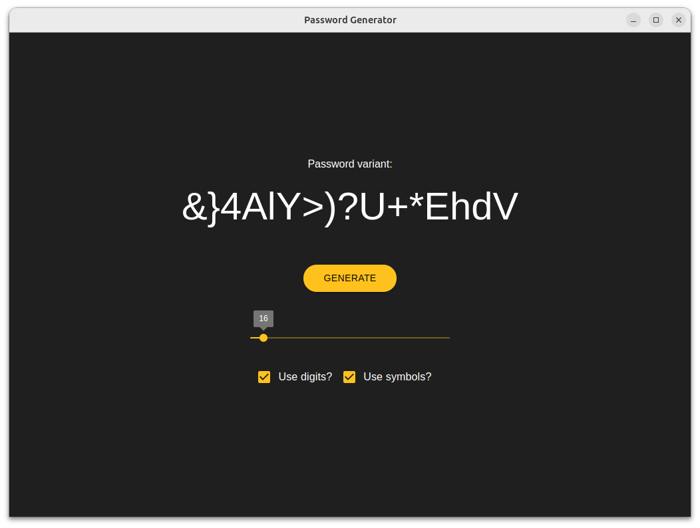

## Password generator
Simple (GUI) tool for generation password.



### Opportunities
* set the password length from 8 to 128 characters
* include / exclude digits and symbols

### Download binary—will be soon
But now you can build it by yourself, just run:
```bash
  npm run package
```
Results will be in `release/build` dir

[//]: # (* linux [passGen download]&#40;https://xxxx;)
[//]: # (* windows [passGen.exe download]&#40;https://xxxx;)

### How to use (Linux)
* download or build the app binary
* set it executable `chmod +x pass-gen-x.x.x.AppImage`
* move to bin folder `sudo mv pass-gen-x.x.x.AppImage /usr/local/bin/pass-gen.AppImage`
* run and enjoy `pass-gen.AppImage`

Note: if you want to use it without .AppImage in name. You need to run it with `--no-sandbox` flag.

Example:
```bash
  chmod +x pass-gen-x.x.x.AppImage
  sudo mv pass-gen-x.x.x.AppImage /usr/local/bin/pass-gen
  pass-gen --no-sandbox
```
#### .deb version note:
If you like .deb variant instead of `.AppImage`. Install binary sht-pass-gen_x.x.x_amd64.deb `apt install ./sht-pass-gen_1.0.0_amd64.deb` and then run it `sht-pass-gen --no-sandbox` with the flag.

### How to use (windows)
Download or build the binary and just install it like an average Windows app. (next→next→...next again...→congratulation) 

### How to build from source
* `npm i && npm run package`

### Thanks (dependencies)
* [electron-react-boilerplate](https://github.com/electron-react-boilerplate/electron-react-boilerplate)
* [passwagen](https://github.com/Axorax/passwagen.js)
